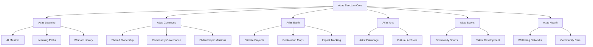

# Atlas Sanctum OS (MVP)

## The Digital Cathedral for Human Flourishing

> **An AI-native platform for community flourishing, regenerative investment, lifelong learning, and covenant stewardship.**

Atlas Sanctum OS brings together **learning, investment, community governance, philanthropy, cultural storytelling, ecological regeneration, sports, and health** into one coherent ecosystem.

The MVP is not designed as another productivity app, social network, learning management system, investment dashboard, or AI assistant.

It is the first expression of a larger idea:

> **Technology should help people become wiser, more connected, more capable, and more willing to serve the flourishing of others and the living world.**

Atlas Sanctum treats software as institutional architecture.

The goal is to create an environment people can **enter, participate in, contribute to, learn from, and help steward**.

---

# 1. Vision

Atlas Sanctum OS is built around a simple proposition:

```text
Learning
+
Community
+
Capital
+
Stewardship
+
Culture
+
Health
+
Purpose
=
Human Flourishing
```

The platform connects personal development with collective action.

A person should be able to:

```text
Learn something
      ↓
Discover a purpose
      ↓
Meet a community
      ↓
Join a mission
      ↓
Contribute time / money / knowledge
      ↓
Create measurable impact
      ↓
Reflect on the experience
      ↓
Grow in wisdom and capability
```

The system should make it easier to move from **intention to participation to stewardship**.

---

# 2. The Cathedral Blueprint

Atlas Sanctum OS is organized around a shared core and six institutional expressions.



The **Atlas Sanctum Core** provides identity, governance, evidence, impact measurement, AI orchestration, and shared data across every module.

---

# 3. MVP Focus

The first release focuses on three foundational experiences:

```text
                 ATLAS SANCTUM OS
                        │
        ┌───────────────┼───────────────┐
        │               │               │
        ▼               ▼               ▼
   ATLAS GUIDE     THE COMMONS     LIVING LEDGER
        │               │               │
        └───────────────┼───────────────┘
                        │
                        ▼
                HUMAN FLOURISHING
```

## I. Atlas Guide

An AI companion for human flourishing.

## II. The Commons

A shared space for missions, ownership, governance, and philanthropy.

## III. The Living Ledger

A multidimensional measure of prosperity beyond financial capital alone.

The rest of the platform grows from these three foundations.

---

# 4. Atlas Guide

## An AI Guide for Human Flourishing

The Atlas Guide is intentionally different from a conventional AI assistant.

It should not be designed around:

* infinite conversation
* engagement optimization
* notification loops
* superficial personalization
* generic productivity advice

Instead, it acts as a **reflection, learning, and stewardship companion**.

Its core question is:

> **What would help this person become more capable of contributing to a flourishing community and world?**

---

## Capabilities

### Personalized Learning Journeys

Build learning paths around:

* User goals
* Interests
* Existing knowledge
* Projects
* Community missions
* Skills gaps
* Reflection
* Long-term aspirations

Example:

```text
Interest:
Ecological Restoration

        ↓

Learning Path

Ecology
   ↓
Watersheds
   ↓
Regenerative Agriculture
   ↓
Community Governance
   ↓
Impact Measurement

        ↓

Community Mission

        ↓

Real-World Practice
```

---

### Ethical Reflection

The Guide can provide structured reflection prompts such as:

* What are you building?
* Who benefits?
* Who might be excluded?
* What responsibilities accompany this opportunity?
* What would remain valuable if nobody rewarded you for it?
* What kind of future does this action strengthen?
* What should be preserved?
* What should be regenerated?

The system should facilitate reflection rather than claim moral authority.

---

### Community Opportunities

The Guide connects users to:

* Projects
* Volunteer opportunities
* Learning communities
* Cultural activities
* Environmental missions
* Philanthropic campaigns
* Sports programs
* Health and wellbeing networks

---

### Stewardship Recommendations

Recommendations can involve:

```text
Time
Money
Knowledge
Skills
Mentorship
Attention
Community participation
Environmental action
Creative contribution
```

---

### Philanthropic Matching

Connect users with missions according to:

* Values
* Interests
* Geography
* Cause areas
* Available resources
* Desired involvement

The platform should explain why a mission was suggested and disclose relevant conflicts or incentives.

---

### Life Mission Journal

A private space for:

* Reflection
* Goals
* Learning notes
* Principles
* Questions
* Milestones
* Projects
* Service commitments

Privacy should be foundational.

---

# 5. Atlas Learning

Atlas Learning turns the platform into a lifelong learning environment.

## Core Components

```text
AI Mentors
Learning Paths
Wisdom Library
Project-Based Learning
Reflection
Skill Graph
Community Learning
```

### AI Mentors

Users can work with specialized mentors across domains such as:

* Technology
* Entrepreneurship
* Ecology
* Leadership
* Arts
* Philosophy
* Civic systems
* Finance
* Community development
* Health literacy

The mentor should show:

```text
Evidence
Sources
Uncertainty
Learning objectives
Progress
Reflection
```

AI should amplify learning rather than replace teachers, institutions, or independent thinking.

---

# 6. The Commons

## A Platform for Shared Missions

The Commons is the collective layer of Atlas Sanctum.

It shifts the framing from:

> **What do I own?**

toward:

> **What are we building together?**

Users can:

* Join initiatives
* Propose projects
* Contribute resources
* Fund causes
* Volunteer
* Track impact
* Participate in governance
* Discover collaborators
* Share knowledge

---

# 7. Shared Ownership

The Commons can eventually support mechanisms for shared participation and ownership.

Examples:

```text
Community Projects
Cooperatives
Collective Funds
Local Initiatives
Shared Infrastructure
Open Knowledge
Mission-Aligned Ventures
```

The MVP should establish the conceptual and data foundations without prematurely implementing complex financial instruments.

---

# 8. Covenant Governance

Governance is designed around transparent participation and shared responsibility.

Potential mechanisms include:

* Proposals
* Deliberation
* Voting
* Delegation
* Contribution history
* Steward roles
* Community charters
* Decision records
* Accountability trails

A governance action should preserve:

```text
Proposal
   ↓
Evidence
   ↓
Discussion
   ↓
Decision
   ↓
Implementation
   ↓
Outcome
   ↓
Learning
```

The objective is not merely to count votes.

It is to create **better collective decision-making**.

---

# 9. Philanthropic Missions

Users and organizations should be able to create missions around:

* Education
* Poverty reduction
* Ecological restoration
* Community infrastructure
* Health
* Arts
* Youth development
* Food systems
* Water
* Local innovation

Each mission should expose:

```text
Purpose
Target Community
Resources Required
Milestones
Evidence
Contributors
Impact
Remaining Needs
```

---

# 10. Atlas Earth

Atlas Earth is the ecological expression of the platform.

It connects people and capital to regeneration.

## Core Features

### Climate Projects

Examples:

* Reforestation
* Watershed restoration
* Mangrove restoration
* Regenerative agriculture
* Soil regeneration
* Biodiversity protection
* Renewable energy
* Water resilience

### Restoration Maps

Show:

```text
Project
Location
Ecosystem
Baseline
Intervention
Progress
Impact
Community
```

### Impact Tracking

Track outcomes such as:

* Trees established
* Area restored
* Water retained
* Soil health
* Biodiversity indicators
* Carbon outcomes
* Jobs created
* Community participation

The system should distinguish **activity metrics** from **actual outcomes**.

---

# 11. Atlas Arts

Culture is treated as a form of capital and memory.

Atlas Arts supports:

* Artist patronage
* Creative projects
* Cultural archives
* Storytelling
* Local heritage
* Oral history
* Exhibitions
* Community creative programs

The platform should preserve provenance and cultural context rather than treating cultural material as generic content.

---

# 12. Atlas Sports

Sport becomes a mechanism for:

* Community connection
* Youth development
* Talent discovery
* Discipline
* Health
* Belonging
* Mentorship

Features can include:

```text
Community Clubs
Tournaments
Talent Profiles
Training Plans
Mentors
Facilities
Scholarships
Progress Tracking
```

---

# 13. Atlas Health

Atlas Health focuses on networks of wellbeing rather than presenting itself as a replacement for clinical care.

The initial layer can include:

* Wellbeing networks
* Community care
* Health education
* Peer support
* Resource discovery
* Community health initiatives

The platform should maintain clear boundaries around clinical decision-making and sensitive health information.

---

# 14. The Living Ledger

## A New Measure of Prosperity

Traditional accounting predominantly answers:

> How much money was created?

The Living Ledger asks:

> **What became healthier, wiser, more connected, more capable, or more regenerative?**

The Living Ledger measures multiple forms of value.

---

# 15. Human Flourishing Index

The primary MVP composite should be built from transparent dimensions rather than treated as a mysterious AI score.

Potential dimensions:

```text
Learning
Health
Purpose
Participation
Belonging
Economic opportunity
Creative contribution
Community contribution
Ecological stewardship
Shared ownership
```

Each dimension should expose:

* Definition
* Inputs
* Methodology
* Data source
* Time period
* Confidence
* Limitations

The platform must avoid presenting subjective or value-laden measurements as objective scientific truth.

---

# 16. Living Ledger Dimensions

### Learning

* Courses completed
* Skills developed
* Learning milestones
* Knowledge contributions

### Ecological Restoration

* Area restored
* Ecosystem health
* Biodiversity indicators
* Water outcomes

### Community Participation

* Volunteer activity
* Community contributions
* Governance participation
* Mission participation

### Artistic Creation

* Projects
* Cultural contributions
* Patronage
* Community creative activity

### Health

* Community wellbeing initiatives
* Access to support
* Prevention participation
* Health-system engagement

### Shared Ownership

* Cooperative participation
* Community asset ownership
* Collective investment
* Shared economic value

---

# 17. Living Ledger Philosophy

The Living Ledger should not become another scoreboard.

Its purpose is to make otherwise invisible forms of value visible.

```text
Money
Knowledge
Time
Care
Trust
Creativity
Nature
Participation
Stewardship
```

The system should therefore avoid reducing everything to one number.

A holistic view should always remain available.

---

# 18. Product Architecture

```text
┌──────────────────────────────────────────────────┐
│                 ATLAS SANCTUM OS                 │
├──────────────────────────────────────────────────┤
│ EXPERIENCE                                       │
│ Guide │ Learning │ Commons │ Earth │ Arts       │
│ Sports │ Health                                   │
├──────────────────────────────────────────────────┤
│ SHARED INTELLIGENCE                              │
│ Recommendations │ Matching │ Discovery           │
│ Reflection │ Impact Analysis                     │
├──────────────────────────────────────────────────┤
│ LIVING LEDGER                                    │
│ Flourishing │ Contribution │ Regeneration        │
├──────────────────────────────────────────────────┤
│ COVENANT GOVERNANCE                              │
│ Proposals │ Participation │ Decisions            │
├──────────────────────────────────────────────────┤
│ ATLAS CORE                                       │
│ Identity │ Graph │ Memory │ Evidence │ Ethics   │
├──────────────────────────────────────────────────┤
│ DATA & INFRASTRUCTURE                            │
│ Users │ Communities │ Projects │ Events         │
│ Resources │ Outcomes │ Knowledge                │
└──────────────────────────────────────────────────┘
```

---

# 19. Atlas Sanctum Core

The Core provides shared infrastructure to every product surface.

## Identity

* User profile
* Skills
* Interests
* Learning history
* Contributions
* Permissions

## Community Graph

Represents relationships between:

```text
People
Communities
Organizations
Projects
Institutions
Places
Resources
```

## Knowledge Graph

Connects:

```text
Questions
Learning
Research
Projects
People
Communities
Cultural Memory
```

## Civilization Memory

Stores meaningful:

* Decisions
* Projects
* Milestones
* Contributions
* Outcomes
* Stories

---

# 20. The Covenant Craftsman's Stack

Atlas Sanctum is designed across four conceptual layers.

| Layer        | Question                    | Product Expression        |
| ------------ | --------------------------- | ------------------------- |
| Philosophy   | What is good?               | Flourishing               |
| Covenant     | What do we owe one another? | Shared stewardship        |
| Architecture | What endures?               | Modular institutions      |
| Technology   | What enables?               | AI, data, and communities |

These layers should remain connected.

Technology exists to serve architecture.

Architecture exists to serve covenant.

Covenant exists to serve flourishing.

---

# 21. Mythic Engineering Prompt

The following design principle should guide implementation:

> **Design Atlas Sanctum as a beautiful, AI-native operating system for human flourishing.**
>
> The platform must embody covenant craftsmanship, long-term stewardship, ethical technology, and regenerative prosperity.
>
> Technology is treated as cathedral architecture: every interface should communicate wonder, trust, and permanence.
>
> Core modules include:
>
> * Atlas Learning — AI mentors and lifelong education
> * Atlas Commons — community ownership and philanthropic action
> * Atlas Earth — ecological regeneration and climate resilience
> * Atlas Arts — creative patronage and cultural memory
> * Atlas Sports — community development through athletics
> * Atlas Health — human wellbeing and care networks
>
> Users should experience the platform as entering a living institution rather than downloading software.
>
> Design principles:
>
> * Beauty over novelty
> * Wisdom over engagement metrics
> * Stewardship over extraction
> * Intergenerational impact over short-term growth
> * Radical accessibility and shared prosperity
>
> The visual language combines sacred geometry, ecological systems, modern technology, and timeless craftsmanship.
>
> The experience should feel like entering a digital cathedral dedicated to human flourishing.

---

# 22. Design Principles

## Beauty Over Novelty

Visual sophistication should arise from clarity, proportion, motion, and meaningful interaction rather than visual gimmicks.

## Wisdom Over Engagement

The platform should not optimize for maximum screen time.

A successful session may end with:

> "I now know what I should do."

## Stewardship Over Extraction

Resources are treated as responsibilities as well as assets.

## Intergenerational Thinking

Important decisions should expose long-term implications.

## Accessibility

Participation should not require wealth, elite education, technical expertise, or institutional privilege.

## Human Agency

AI supports exploration, learning, and decision-making without replacing human responsibility.

## Transparency

Recommendations should be explainable and traceable to evidence where applicable.

---

# 23. MVP User Journey

A new user joins Atlas Sanctum.

### Step 1 — Orientation

The platform asks:

```text
What are you curious about?
What do you want to learn?
What communities matter to you?
What problems do you care about?
How would you like to contribute?
```

### Step 2 — Atlas Guide

The Guide creates a starting path.

```text
Interests
   ↓
Learning
   ↓
Reflection
   ↓
Community
   ↓
Mission
```

### Step 3 — Discover the Commons

The user sees projects and missions aligned with their interests.

### Step 4 — Join a Mission

They contribute:

```text
Time
Money
Skills
Knowledge
Creative work
```

### Step 5 — See the Living Ledger

Their contribution becomes visible as part of a larger collective outcome.

### Step 6 — Reflect

The Guide helps the user understand:

```text
What did I learn?

Who did I help?

What changed?

What should I do next?
```

The loop becomes:

```text
Learn
 ↓
Connect
 ↓
Contribute
 ↓
Create
 ↓
Regenerate
 ↓
Reflect
 ↓
Learn Again
```

---

# 24. Core Domain Model

Initial entities:

```text
User
Profile
Community
Organization
Project
Mission
LearningPath
Course
Mentor
Reflection
Contribution
Donation
Proposal
Decision
Vote
ImpactMetric
LedgerEntry
EcologicalProject
Artwork
SportProgram
HealthNetwork
Resource
Place
Event
Story
Evidence
Outcome
```

---

# 25. Suggested Frontend Architecture

```text
src/
├── app/
│   ├── routes/
│   ├── layouts/
│   └── providers/
│
├── components/
│   ├── core/
│   ├── guide/
│   ├── learning/
│   ├── commons/
│   ├── earth/
│   ├── arts/
│   ├── sports/
│   ├── health/
│   └── ledger/
│
├── features/
│   ├── onboarding/
│   ├── ai-guide/
│   ├── learning/
│   ├── missions/
│   ├── governance/
│   ├── philanthropy/
│   ├── ecological-projects/
│   └── impact/
│
├── domain/
│   ├── users/
│   ├── communities/
│   ├── projects/
│   ├── contributions/
│   ├── learning/
│   └── outcomes/
│
├── services/
│   ├── api/
│   ├── ai/
│   ├── matching/
│   └── analytics/
│
├── state/
├── hooks/
├── types/
├── utils/
└── styles/
```

---

# 26. Core Interface

The primary navigation can be:

```text
Home
Guide
Learn
Commons
Earth
Arts
Sports
Health
Ledger
```

Supporting navigation:

```text
Search
Notifications
Messages
Profile
Governance
Impact
Settings
```

The interface should preserve a sense of one institution rather than feeling like seven unrelated products.

---

# 27. AI Architecture

The Atlas Guide should sit on an AI orchestration layer rather than a single conversational model.

Potential capabilities:

```text
Learning Recommendation
Mission Matching
Reflection
Knowledge Retrieval
Project Discovery
Impact Interpretation
Community Summarization
Research Synthesis
Personal Planning
```

Every AI output should have access to appropriate:

* Context
* User preferences
* Evidence
* Safety constraints
* Privacy boundaries
* Uncertainty
* Source information

---

# 28. AI Interaction Model

The Guide should move beyond:

```text
User
 ↓
Question
 ↓
Answer
```

toward:

```text
User Intent
 ↓
Context
 ↓
Knowledge
 ↓
Reflection
 ↓
Options
 ↓
Action
 ↓
Outcome
 ↓
Learning
```

The system should encourage users to think rather than simply generating answers for them.

---

# 29. Recommendation Principles

Recommendations should optimize for:

```text
Relevance
Potential benefit
Learning value
Community benefit
Ecological responsibility
User agency
Long-term value
```

The platform should expose why something was recommended.

Example:

> **Recommended mission: Nairobi Watershed Restoration**

```text
Why this matches you:
• You are learning ecology.
• You expressed interest in water systems.
• The project needs data and community volunteers.
• Your selected location overlaps the project's operating area.
```

---

# 30. Impact and Evidence

Every major impact claim should distinguish:

```text
Activity
Output
Outcome
Long-term Impact
```

Example:

```text
10,000 trees planted
        ↓
Trees established
        ↓
Improved watershed conditions
        ↓
Ecological and livelihood outcomes
```

Counting activity alone should not be presented as proof of impact.

---

# 31. Governance and Accountability

Atlas Sanctum must maintain records of:

* Proposals
* Decisions
* Contributions
* Project milestones
* Impact claims
* Governance actions
* Steward roles

A user should be able to understand:

> **Who decided this?**

> **Based on what?**

> **What happened afterward?**

This creates institutional memory.

---

# 32. Privacy

Some parts of Atlas Sanctum are inherently personal.

Especially:

* Journal entries
* Learning profiles
* Health-related information
* Private reflections
* Personal finances
* Community participation

The system should use:

* Data minimization
* Encryption
* Fine-grained access control
* Explicit sharing controls
* Audit logs
* Deletion mechanisms
* Privacy-preserving analytics

The default assumption should be:

> **Personal reflection belongs to the person unless they intentionally share it.**

---

# 33. Accessibility and Inclusion

Atlas Sanctum should be designed for broad participation.

Priorities include:

* Responsive design
* Keyboard navigation
* Screen-reader support
* High contrast
* Reduced motion
* Low-bandwidth experiences
* Mobile-first community workflows
* Accessible language
* Progressive disclosure

The system should work for a community member with a smartphone and limited bandwidth as well as an institutional user with a desktop workstation.

---

# 34. Cultural Architecture

Atlas Sanctum should support multiple forms of knowledge.

These may include:

```text
Scientific Knowledge
Traditional Knowledge
Community Knowledge
Professional Knowledge
Lived Experience
Historical Memory
Cultural Storytelling
```

The platform must preserve provenance and context.

It should not treat all knowledge as interchangeable or erase local ownership.

---

# 35. MVP Technical Priorities

## Phase 1 — Foundation

Build:

* Authentication
* User profiles
* Atlas Guide
* Commons feed
* Project pages
* Living Ledger foundation
* Core design system

## Phase 2 — Learning

Add:

* AI mentors
* Learning paths
* Knowledge library
* Progress
* Reflection

## Phase 3 — Commons

Add:

* Missions
* Contributions
* Governance
* Proposals
* Voting
* Philanthropic workflows

## Phase 4 — Living Ledger

Add:

* Flourishing metrics
* Contribution tracking
* Impact data
* Community outcomes

## Phase 5 — Earth / Arts / Sports / Health

Add foundational verticals with shared architecture.

## Phase 6 — Institutional Network

Expand to:

* Organizations
* Foundations
* Schools
* Universities
* Governments
* Community organizations
* Regenerative enterprises

---

# 36. Definition of Done

The MVP is successful when a new participant can:

1. Create a profile.
2. Define interests and goals.
3. Meet the Atlas Guide.
4. Receive a personalized learning path.
5. Discover a community mission.
6. Join a project.
7. Contribute time, money, skills, or knowledge.
8. See the contribution recorded.
9. Understand the resulting collective impact.
10. Reflect on what they learned.
11. Discover the next meaningful opportunity.

The experience should feel coherent from beginning to end.

---

# 37. The First Proof of Wonder

The ultimate MVP test is not a retention chart.

It is not session duration.

It is not notification frequency.

It is not the number of AI messages exchanged.

The first proof of wonder is a human response:

> **"This platform made me wiser, more connected, more hopeful, and more capable of serving others."**

That is the product's north star.

---

# 38. Long-Term Vision

The MVP is the seed of a much larger ecosystem.

```text
                         ATLAS SANCTUM OS
                                │
            ┌───────────────────┼───────────────────┐
            │                   │                   │
            ▼                   ▼                   ▼
       ATLAS GUIDE        ATLAS COMMONS      LIVING LEDGER
            │                   │                   │
            ├───────────┬───────┴───────┬──────────┤
            │           │               │          │
            ▼           ▼               ▼          ▼
         LEARNING     EARTH            ARTS      SPORTS
            │           │               │          │
            └───────────┴───────┬───────┴──────────┘
                                │
                                ▼
                              HEALTH
                                │
                                ▼
                       COMMUNITY FLOURISHING
                                │
                                ▼
                       REGENERATIVE PROSPERITY
```

The long-term ambition is not merely to create software features.

It is to create a digital environment where:

* Knowledge becomes action.
* Capital becomes stewardship.
* Communities become institutions.
* Culture becomes memory.
* Technology becomes wisdom infrastructure.
* Participation becomes measurable contribution.
* Regeneration becomes economically and socially visible.

---

# 39. Design Philosophy

Atlas Sanctum should feel like entering a **living institution**.

The interface should combine:

* Sacred geometry
* Ecological systems
* Scientific visualization
* Modern interface design
* Timeless craftsmanship
* Quiet motion
* Natural materials and textures
* Generous spatial composition

The design should communicate:

> **Wonder without spectacle.**

> **Authority without domination.**

> **Technology without dehumanization.**

> **Beauty without distraction.**

---

# 40. Engineering Philosophy

The codebase should reflect the philosophy of the product.

### Modular

Each vertical should be independently extensible.

### Composable

Shared primitives should power every experience.

### Evidence-aware

Impact and intelligence systems should maintain provenance.

### Human-centered

User agency remains central.

### Observable

Important system behavior should be traceable.

### Evolvable

The MVP must provide foundations for a broader institutional platform rather than becoming a disposable prototype.

---

# 41. Repository Structure

A possible repository:

```text
atlas-sanctum-os/
│
├── apps/
│   ├── web/
│   └── api/
│
├── packages/
│   ├── ui/
│   ├── design-system/
│   ├── atlas-guide/
│   ├── learning/
│   ├── commons/
│   ├── earth/
│   ├── arts/
│   ├── sports/
│   ├── health/
│   ├── living-ledger/
│   ├── governance/
│   ├── knowledge/
│   └── identity/
│
├── data/
│   ├── schemas/
│   ├── fixtures/
│   └── seed/
│
├── docs/
│   ├── architecture/
│   ├── governance/
│   ├── ethics/
│   └── product/
│
└── README.md
```

---

# 42. Core Product Loop

Everything ultimately returns to one loop:

```text
           LEARN
             ↓
         UNDERSTAND
             ↓
          CONNECT
             ↓
         CONTRIBUTE
             ↓
           CREATE
             ↓
         REGENERATE
             ↓
          REFLECT
             ↓
           GROW
             │
             └───────────────► LEARN
```

Atlas Sanctum exists to make this loop easier for individuals and communities to enter and sustain.

---

# 43. Final Product Definition

> **Atlas Sanctum OS is an AI-native digital institution for human flourishing that connects lifelong learning, community governance, regenerative investment, philanthropy, cultural memory, ecological stewardship, sports, and wellbeing through a shared intelligence and impact layer.**

It is built around a different definition of technology:

> **Technology should not merely make civilization faster. It should help civilization become wiser.**

And a different definition of prosperity:

> **Prosperity is not only what we accumulate. It is what we cultivate, preserve, share, and pass forward.**

And a different definition of success:

> **A successful platform leaves people and communities more capable of flourishing than it found them.**

---

# Atlas Sanctum OS

### The Digital Cathedral for Human Flourishing

```text
BEAUTY OVER NOVELTY.
WISDOM OVER ENGAGEMENT.
STEWARDSHIP OVER EXTRACTION.
LONG-TERM FLOURISHING OVER SHORT-TERM GROWTH.
TECHNOLOGY IN SERVICE OF HUMAN DIGNITY.
```

> **The first proof of wonder:**
>
> *"This platform made me wiser, more connected, more hopeful, and more capable of serving others."*

Cathedrals were never built merely to house people.

**They were built to transform them.**

Atlas Sanctum begins with software.

Its ambition is to help build the institutions, communities, knowledge, culture, and stewardship required for humanity to flourish.
